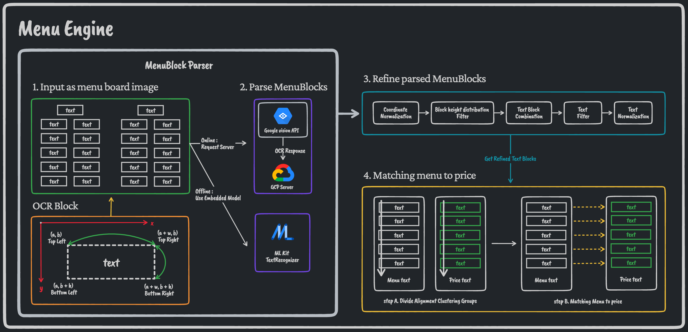
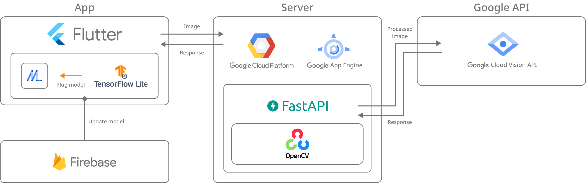
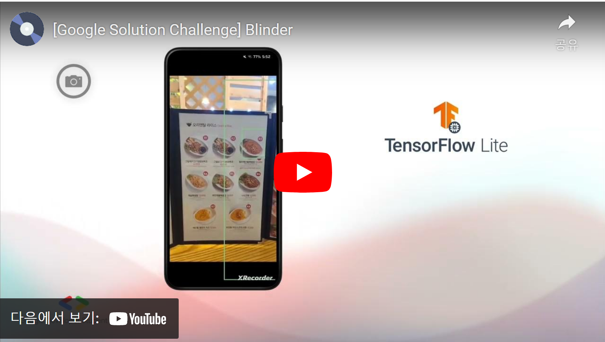

# Blinder

> `Bl`ind + `in`dependent + or`der`

 

# The Problem We Faced 🤔

Initially, we thought that the widespread use of Braille menus would solve this problem, but our statistical research showed that only 9.6% of the blind in South Korea could understand Braille, which means that providing menus in Braille is not a fundamental solution in a country where only a small percentage of the population can understand it. In addition, the growing number of kiosks is exacerbating the problem of ordering meals for the blind.

Blind People face many inconveniences in their daily lives. Even ordering food can be a challenge for them. We researched the problems that blind people face when ordering food. Through interviews with blind peoples, blind social welfare workers, and YouTube videos contents, we found that blind people feel difficulty of understanding the exact menu and prices without help from others, and are uncomfortable asking others for help.

Team Blinder's goal is to solve this problem: to create a society where blind people can comfortably order the food they want without the help of others.

# Solution ✅

Our goal is to help blind people recognize menus and order without assistance. The most important thing was to capture the menu through the user's camera and present the menu in the most convenient way for blind people: by sound and optimized UI.

This is accomplished by the following process

1. Detect the menu in real-time on the camera screen using a `TFLite` model trained with menu images.
2. Use the `Flutter` TTS package to determine if the menu board is visible on the user's camera.
3. If a **menu board** is **detected**, app will **automatically take a photo.**
4. Crop the captured image to extract the target menu board and get the OCR data of the menu board through the `Google Vision API`.
5. Process the OCR data into menus and prices using algorithms.

    

6. Provide intuitive menu to price information based on blind people’s real feedback.

 

# Technology ⚙️

## Used Technology

-   `Flutter`
-   `Firebase`
-   `TensorFlow Lite`
-   `Google Vision API`
-   `Google Cloud Platform`
-   `OpenCV`
-   `FastAPI`

## Higher Order Component Architecture

# Live Demo 🚀

 

# UN-SDGs: **Reduced Inequalities**

We select **10. Reduced Inequalities** from the United Nations' Sustainable Development goal(s).

We wanted to address the discomfort of people with disabilities by focusing on target **10.3 Ensure equal opportunities and reduce inequalities in outcomes, including by eliminating discriminatory laws, policies and practices and promoting appropriate laws, policies and measures in this regard**, which is a sub-target of 10. Reduced Inequalities.

We want to address the discomfort of people with disabilities, especially blind people, and furthermore, we want to eliminate discriminatory practices against blind people and improve policies and awareness of them.

 

# Demo Video Link 🔗

 

# Getting Started 📲

### **[Download APK File](notion://www.notion.so/gdsc-cau/README-d6f54b89a1794d22b5840a141397549a)**

# Contributors 👨🏻‍💻

| Name   | Jang Junesung               | Han Shin                     | Lee HyunSub        | Park Ilsang               |
| ------ | --------------------------- | ---------------------------- | ------------------ | ------------------------- |
| Github | https://github.com/danpacho | https://github.com/Urchinode | Lee HyunSub        | https://github.com/1lsang |
| Email  | danpa725@cau.ac.kr          | vrdhan212@gmail.com          | hyonklee@gmail.com | ilsangpark.98@gmail.com   |

# Conventions 🛠️

Check out our **[convention rules](./conventions.md)**!
