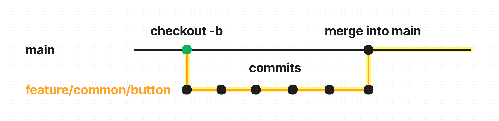

# Project code guideline

## Commit Rules

| Commit Type | Usage                                                 |
| ----------- | ----------------------------------------------------- |
| `feat`      | **add feature**                                       |
| `fix`       | **bug fix**                                           |
| `docs`      | **update documentation**                              |
| `style`     | **code formatting (ex: fix missing semicolon)**       |
| `refactor`  | **code refactoring**                                  |
| `test`      | **add test code**                                     |
| `chore`     | **update/add package, extra update ex) `.gitignore`** |
| `design`    | **update UI design**                                  |
| `rename`    | **rename file/folder**                                |
| `remove`    | **remove file/folder**                                |
| `!BREAKING` | **breaking change of application `API`**              |
| `!HOTFIX`   | **fix critical bug**                                  |

## Branch Rules



1. **Generate** branch and **checkout** branch

```bash
git checkout -b {branch-type}/{main-category}/{sub-category}
```

2. Start develope in the `{branch-type}/{main-category}/{sub-category}` branch

-   should follow **commit rules**
-   Commit should be split into as **small functional units** as possible

3. Create **Pull Request**

-   **Review your code quality** with coworkers
-   Resolve branch conflict with `main`, if conflict ocurred ( locally / github conflict resolve )

4. Merge branch into `main`

5. **Pull merged branch into your local machine**

    1. change your branch to `main`

    ```bash
    git checkout main
    ```

    2. **pull merged code** into `main`

    ```bash
    git pull origin main
    ```

6. **Repeat cycle** `1~5`
